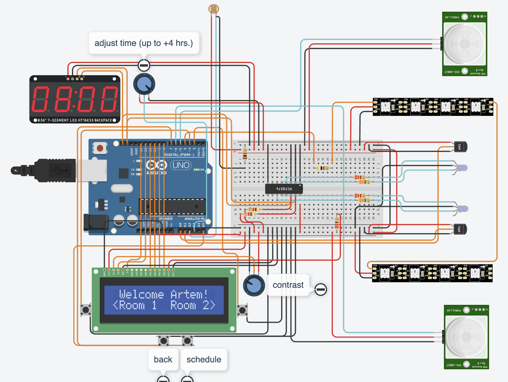

# Home Automation System for Arduino

### Overview

[-> Tinker this <-](https://www.tinkercad.com/things/7ugPAlFP3DJ-embedded-systems-project?sharecode=_9nOga9abY1Xdm3IzMDmvdoAxvJlJMGk7GzS_v6RFyc)

This project is a home automation system built for Arduino, featuring an LCD screen that displays various menus for controlling lights and temperature in two rooms. The system uses several hardware components, including an LCD display, NeoPixel LED strips, and temperature sensors.

### Setting a Schedule
To set a schedule for the light in a room, follow these steps:
1. Navigate to the one of the room's light control menu.
2. Set non-zero light intensity.
3. Enter schedule mode - while in the light control menu, press the schedule button to enter the schedule setting mode.
4. Adjust the Schedule - use the left and right buttons to select the hour for which you want to set the light intensity.
5. Press the schedule button to set the current light intensity for the selected hour.
6. You can now navigate back to the previous menu using the back button - schedule is saved automatically.

### Codebase Structure
Key Components:
1. Main Program (`src/impl/main.cpp`)
Initializes hardware components and sets up the main loop.
Handles the display and interaction logic for the welcome screen and room menus.
2. Room Control (`src/impl/RoomControl.cpp`)
Manages the state and behavior of individual rooms, including temperature and light control.
Contains methods for displaying and handling room-specific menus.
3. General Utilities (`src/impl/general.cpp`)
Provides utility functions for handling hardware interactions and general tasks like printing to the LCD.
